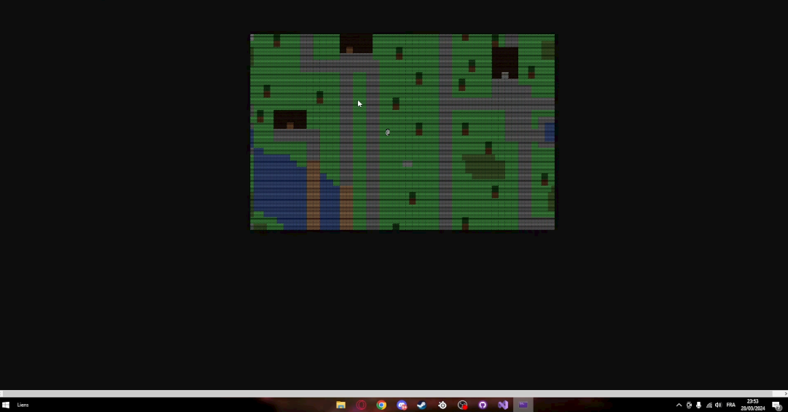
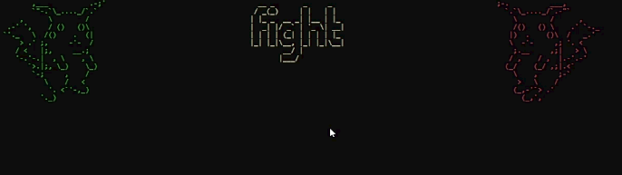
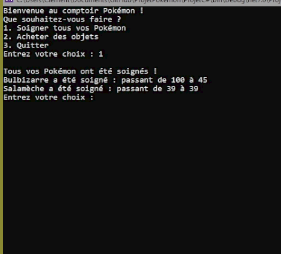
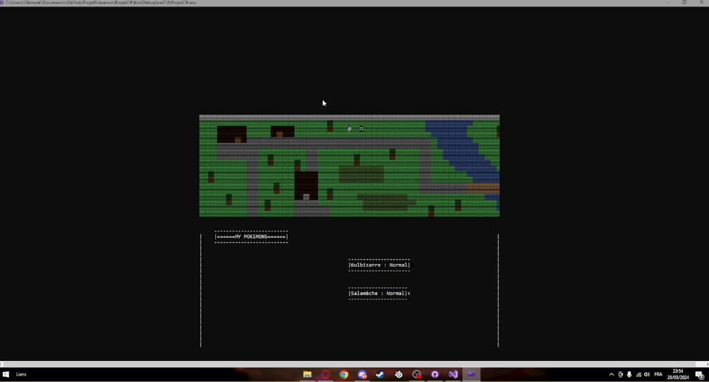

# Pokemon Game

Développement d'un jeu console en C# recopiant les mécaniques des jeux Pokemon.
Développement des compétences de programmation C#.
Equipe de 3 développeurs.

## Description

Ce jeu est un petit jeu développé en une semaine avec 2 autres étudiants, visant à améliorer mes compétences en développement C# et utilisation de POO.

## Technologies utilisées

- C#
- Git
- AsciiArt

## Captures d’écran

## Auteurs

Benjamin Benon  
[LinkedIn](https://www.linkedin.com/in/benjamin-benon-78b495194/)  
Clément Faye  
[LinkedIn](https://www.linkedin.com/in/cl%C3%A9ment-faye-853142275/)  
William Chapron
